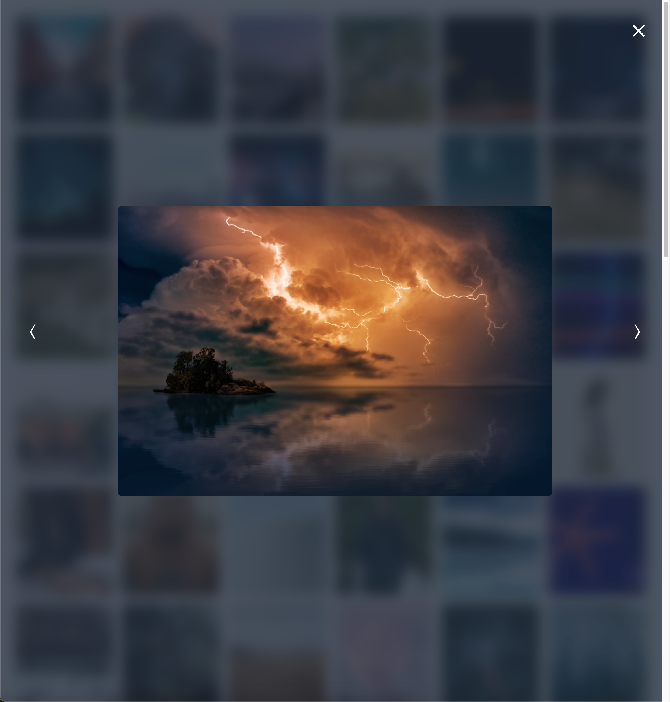

# svelte-lightbox-gallery

```bash
npm i -D svelte-lightbox-gallery
```

## What is svelte-lightbox-gallery?

svelte-lightbox-gallery is an easy to use gallery for your svelte project. it doesn't offer a lot of customisation options by default, for customisation consider downloading it from my [github repo](https://github.com/joergjan/svelte-image-gallery) and changing it on your own. The package utilizes tailwindcss for styling.

## Preview

visit [npm.jan-joerg.ch/svelte-lightbox-gallery](https://npm.jan-joerg.ch/svelte-lightbox-gallery)

## Usage

```svelte
<script lang="ts">
	import Gallery from 'svelte-image-gallery';

	let photos: string[] = [
		'https://source.unsplash.com/random/?city,night',
		'https://source.unsplash.com/random/?city,animal',
        ...
	];
</script>

<SvelteGallery {photos} />
```

## don't forget this!

since this library works with tailwindcss, you have to adjust your tailwind.config.js to include the gallery. Check out the [tailwind documentation](​​https://www.tailwindcss.com/docs/content-configuration#working-with-third-party-libraries)

```typescript
/** @type {import('tailwindcss').Config} */

module.exports = {
	content: [
		'./src/**/*.{html,js,svelte,ts}',
		'./node_modules/svelte-lightbox-gallery/dist/*.svelte'
	]
};
```

## Customization

```typescript
export interface GalleryProps {
	/**
	 * Array of photo URLs
	 */
	photos: string[];

	/**
	 * Amount of photos to before  "show more" button
	 * 0 => no button, all photos are shown at once
	 */
	amount?: number;

	/**
	 * darkmode (default: false)
	 */
	dark?: boolean;

	/**
	 * show more Button color with tailwind syntax, example: "bg-gray-500 hover:bg-gray-600"
	 */
	buttonColor?: string;
}
```

```svelte
<script>
	import Gallery from 'svelte-lightbox-gallery';

	let photos = [
		'https://source.unsplash.com/random/?city,night',
		'https://source.unsplash.com/random/?city,animal',
		...
	];
</script>

<div class="p-7">
	<Galery {photos} amount={12} dark={true} buttonColor="bg-green-500 hover:bg-green-600" />
</div>
```



